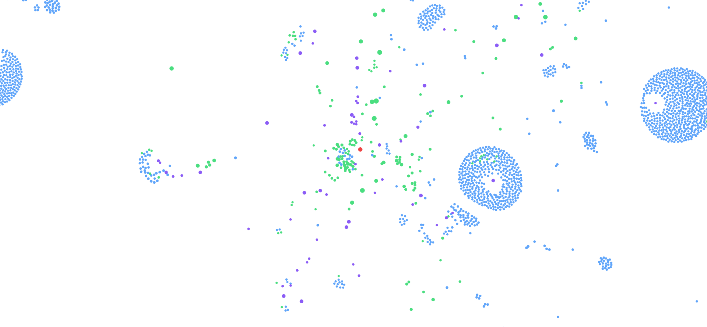

# WhatsApp Social Graph

Visualize your WhatsApp network as an interactive social graph. This tool connects to your WhatsApp account (via Waha + Puppeteer), fetches your chat history, and builds a force-directed graph showing relationships between you, your contacts, and groups.



## Features

-   **Interactive Visualization**: Zoom, pan, and drag nodes.
-   **Social vs Structural Views**:
    -   *Structural Mode*: Shows direct connections to groups.
    -   *Social Mode*: Infers connections between people based on shared groups (hides group nodes).
-   **Dynamic Node Sizing**:
    -   **Size Mixer**: Adjust node size priority between **Message Volume** (how much you talk) and **Network Connections** (how connected they are).
-   **Smart Filtering**:
    -   Filter by Timeframe (Last Week, Month, Year).
    -   Hide Archived Chats.
    -   Filter by Minimum Messages or Connections.
    -   Show/Hide "Me" node.
-   **Data Management**:
    -   **Import/Export**: Save your graph data to JSON and load it later (or share with friends).
    -   **Fetch Limit Control**: Choose how many messages to analyze per chat (50, 100, 200, 500) for deeper or faster analysis.
-   **Privacy & Demo Mode**:
    -   **Hide UI**: Press **'H'** to toggle the interface for clean screenshots.
    -   **Logout**: Securely logout to return to the QR code screen for multi-user demos.
-   **Insights**:
    -   Top Contacts & Groups.
    -   "Bridge People" (Connectors between groups).
    -   "Lone Wolves" (Direct contacts not in groups).

## Technology Stack

-   **Frontend**: React, Vite, `react-force-graph-2d`, TailwindCSS.
-   **Backend**: Node.js, Express, Socket.IO.
-   **WhatsApp API**: Waha (WhatsApp HTTP API) running on Puppeteer (WEBJS engine).
-   **Containerization**: Docker & Docker Compose.

## Prerequisites

-   Docker and Docker Compose installed.
-   A WhatsApp account on your phone.

## How to Run

1.  **Clone the repository**.
2.  **Start the services**:
    ```bash
    docker-compose up -d
    ```
3.  **Open the application**:
    Access [http://localhost:5173](http://localhost:5173).
4.  **Scan the QR Code**:
    Open WhatsApp on your phone -> Linked Devices -> Link a Device -> Scan the QR code displayed on screen.
5.  **Wait for Processing**:
    The app will fetch your contacts and chat history. This may take a few minutes depending on your chat volume and the "Fetch Limit" setting.
    *Default limit is 50 messages per chat for speed.*

## Controls Guide

### Advanced Filters
-   **Node Size Weight**: Slider to balance size calculation.
    -   Left (0%): Size based purely on Message Count.
    -   Right (100%): Size based purely on Number of Connections.
-   **Fetch Limit**: Select a limit (e.g., 200) and click **Reload** to fetch more history. Warning: Takes longer!
-   **Export/Import**: Use the buttons to save your graph state.

### Keyboard Shortcuts
-   **H**: Toggle User Interface (useful for presentations/screenshots).

### Troubleshooting

-   **Stuck on "Fetching chats..."**: If you have thousands of chats, this step can take up to 5 minutes. The timeout has been increased to handle this. Please be patient.
-   **Infinite Loop**: If the app keeps restarting processing, ensure you utilize the latest version which fixes a critical crash bug.
-   **QR Code not appearing**: Check the logs `docker logs whatsapp-social-graph-server-1`. If Waha is starting up, it might take 10-20 seconds.

## License

MIT
